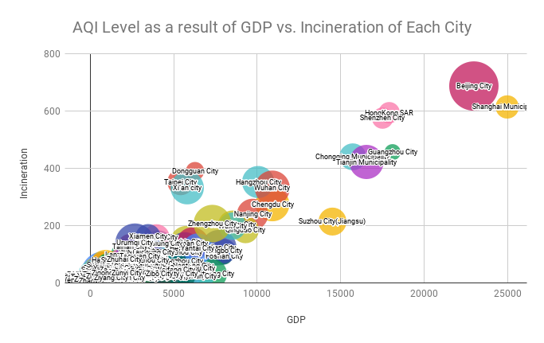

# Spreadsheet Analysis
A little assignment to practice finding data, munging it, and analyzing it in a spreadsheet program.
## 1)Dataset Details
In this project, I used the Kaggle dataset [China AQI and correlative factors dataset(Version 5)](https://www.kaggle.com/maxwellnee/china-aqi-test) created by Pin Ni (kaggelID:maxwellnee), which includes China Air Quality Index and its correlative factors' data of 2015 in one dataset of 324 lines(including 1 title row) and 12 columns. The datafile is originally in CSV format, and is saved in the "data" repository as "[raw_data.csv](https://github.com/evewyang/Database-Design-and-Implementations/blob/main/spreadsheet-analysis-evewyang/data/raw_data.csv)". The title row and the first 20 rows in the file is displayed as following:
|City            |AQI|Precipitation|GDP   |Temperature|Longititute|Latitude|Altitude|PopulationDensity|Coastal|GreenCoverageRate|Incineration(10,000ton)|
|----------------|---|-------------|------|-----------|-----------|--------|--------|-----------------|-------|-----------------|-----------------------|
|Ngawa Prefecture|23 |665.1        |271.13|8.2        |102.22465  |31.89941|2617    |11               |0      |36               |23                     |
|Aksu City       |137|80.4         |610   |12.27671233|80.26338   |41.16754|1108    |6547             |0      |33.94            |23                     |
|Alxa League     |85 |150          |322.58|24.2       |105.72895  |38.85192|1673    |1                |0      |36               |23                     |
|Ngari           |28 |74.2         |37.4  |1          |80.1058    |32.50111|4280    |1                |0      |36               |23                     |
|Anqin City      |79 |2127.8       |1613.2|17.29178082|117.0344315|30.51264572|13      |2271             |0      |45.8             |27.48                  |
|Anyang City     |110|672.1        |1884.48|15.35068493|114.3500519|36.09685135|71      |4735             |0      |36.28            |54.51                  |
|Anshan City     |111|708          |2326  |11.41232877|122.9843826|41.11525726|49      |2534             |0      |38.25            |58.13                  |
|Macao SAR       |44 |2000         |3358  |22         |113.54387  |22.19874|40      |20547            |1      |41               |22                     |
|Bayannur City   |53 |188          |887.43|3.7        |107.38765  |40.74321|1042    |5093             |0      |35.12            |15.98                  |
|Bazhong City    |58 |1198.9       |501.34|16.9       |106.75476  |31.849014|443     |2653             |0      |39.11            |15.09                  |
|Bengbu City     |96 |910          |1253.1|16.01369863|117.3613815|32.93924332|25      |2599             |0      |38.48            |29.61                  |
|Baotou City     |45 |262.9        |3781.93|8.91369863 |109.8517075|40.6664238|1065    |2130             |0      |37               |52.29                  |
|Baoji City      |111|695          |1788.59|14.83424658|107.1383591|34.38228607|567     |5352             |0      |40.61            |36.54                  |
|Baoding City    |220|566.9        |2757.8|13.25890411|115.5001831|38.85707092|17.2    |4565             |0      |30.96            |49.27                  |
|Baoshan City    |56 |1000         |552   |17.39178082|99.16872406|25.11680222|1673    |4529             |0      |31               |10.95                  |
|Beihai City     |23 |1670         |892.1 |24.61643836|109.1191711|21.47979736|21      |458              |1      |27.45            |24.74                  |
|Beijing City    |296|458.9        |22968.6|13.77260274|116.3809433|39.9236145|31.2    |1292             |0      |34               |686.67                 |
|Benxi City      |63 |900          |1160  |9.271232877|123.7645035|41.28758621|100     |602              |0      |44.88            |31.76                  |
|Binzhou City    |142|564.8        |2355.33|14.11643836|118.0217667|37.36781311|9       |1110             |0      |42.92            |27.99                  |
|Haozhou City    |59 |831          |942.6 |10.58695652|115.7709   |33.879292|39      |3693             |0      |41.32            |17.66                  |

The data is read into `munge.py` and saved to a list where each item in this list is a sub-list containing values of a row, and the values are seperated by using `line.split(',')`. In case that there might be lines with empty cells, I loop through each line to check if there's "None" in that list, and drop that line if found any.  
Notice that data is not sorted explicitly based on any column's values, which might be a potential problem in searching values based on criterion. Thus, sorting of rows based on first column's city name in alphabetical order has been done using `list.sort()`. Also, the decimal places are not costitent through out columns; with several columns having excessive floating digits, it is hard to read and inteperate, and after importing into spreadsheet values can be blocked unless you stretch the cell manually. For simplisity, I rounded all digit values to integers.  
The column "Costal" uses 0 for "non-costal city" and 1 for "costal city", and it might be hard to understand for new developers unfamiliar with cities in China, so I converted the values, 0 to 'no' and 1 to 'yes'[`if new_line[-3] == 0:(new_line[-3] = 'no')else:(new_line[-3] = 'yes'`]), to prepare for comprehensable selection of cells in spreadsheets. 
The munged data is saved as [clean_data.csv](https://github.com/evewyang/Database-Design-and-Implementations/blob/main/spreadsheet-analysis-evewyang/data/clean_data.csv), and this is the datafile to be imported into the spreadsheet, showing as following:
|City       |AQI|Precipitation|GDP |Temperature|Longititute|Latitude|Altitude|PopulationDensity|Coastal|GreenCoverageRate|Incineration(10,000ton)|
|-----------|---|-------------|----|-----------|-----------|--------|--------|-----------------|-------|-----------------|-----------------------|
|Aksu City  |137|80           |610 |12         |80         |41      |1108    |6547             |no     |34               |23                     |
|Alxa League|85 |150          |323 |24         |106        |39      |1673    |1                |no     |36               |23                     |
|Anqin City |79 |2128         |1613|17         |117        |31      |13      |2271             |no     |46               |27                     |

## 2)Dataset Analysis
For this section, I imported the CSV file of the cleaned data into Google Sheets, and named this worksheet "clean_data". Analysis of data is in another sheet named "evaluation". Link to the Google Sheet can be found [here](https://docs.google.com/spreadsheets/d/1MybeuY1Sbu0Lrn0qwQug9MRRlL-30FBEd-J-9dNTWbg/edit?usp=sharing).
### Aggregate statistics
For each columns of the data, I calculated the maximum, median, minimum, and average using MAX(), MIN(), MEDIAN(), and AVERAGE() respectively. For simplicity, the averages are rounded to 2 decimal places using ROUND(average, 2). After computing each statistics, the corresponding city that obtains such value is located using INDEX() and MATCH() functions, e.g.`=index(clean_data!A:A,match(C4,clean_data!$B:$B,0))` to find that city with the max AQI is Beijing City, given max AQI listed in C4 and AQI in clean_data column B.  
As the dataset is about the AQI and related factors, it is important to get a sense about central tendency and the dispersion of each variable. Ralating to specific city that obtains extreme values, it would be good start to dive into the relationship of that city's characteristic, whether demographical or geographical, to its resulting AQI.    
### Aggregate statistics with conditions
Discussion of data is seperated to the cases of costal cities and non-costal cities. I used criterions in extracting data, such as using `=MAXIFS(clean_data!B:B,clean_data!$J:$J,"yes")` to find the highest value among the AQI's of all costal cities. The division of cities based on adjacency to the sea intuitively bases on the fact that these two kinds of cities in China would have completely different specializations in production. This can by supported by the my aggregate statistics of Average GDP, that the value of costal cities is more than 1,000 higher comparing to that of non-costal cities. Also, this seperation makes discussion regarding environmental factors possible. For instance, sea cost cities on average have higher Precipitation rate and GreenCoverageRate, which may be useful in selecting variables to draw correlations between independent and dependent factors.
### Visualizing Data

The above Bubble plot is generated by GPD of cities on the x-axis and Incineration of cities on the y-axis. The radius of each bubble represents the AQI Level of that city. By using a bubble scatter plot, it shows the correlation between GDP and incineration, which is slitely positive, indicating that cities with high GDP usually has high incineration level. Also, the radius of the circle is mostly smaller at lower GDP and lower Incineration, showing the relational impact of these two onto the AQI Level. 
