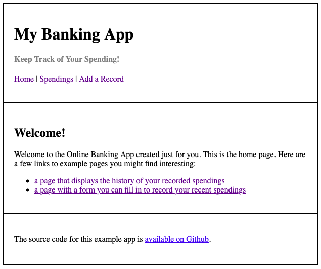
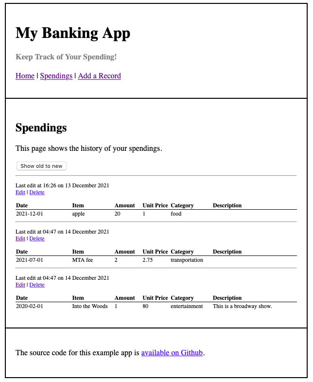
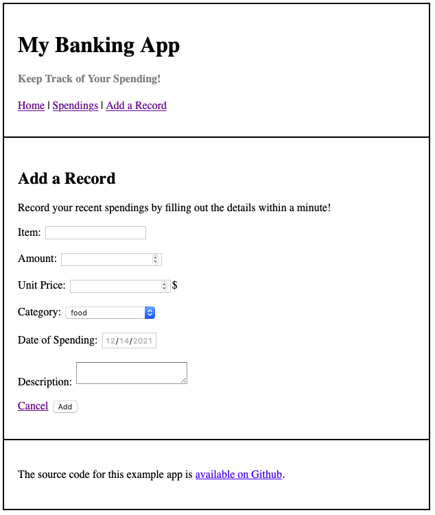
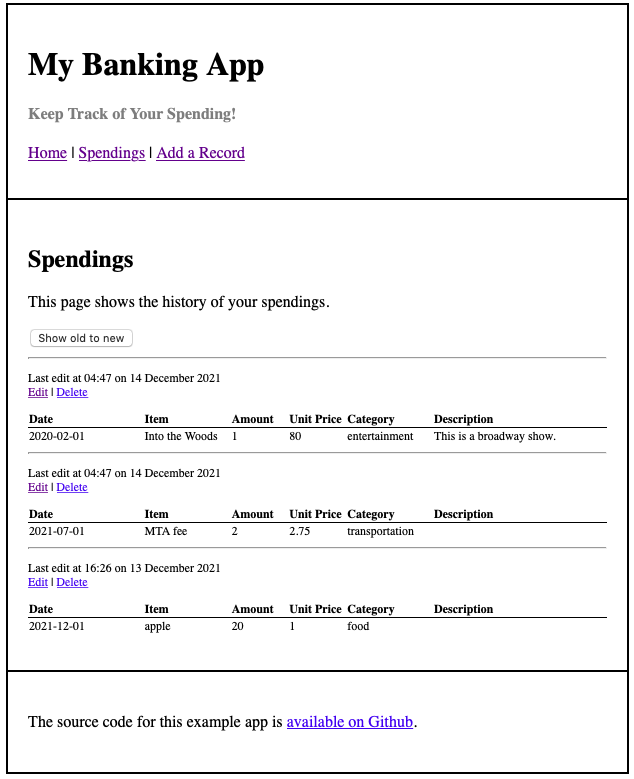

# Flask-MongoDB Web App

## Description
The title of [My app](https://i6.cims.nyu.edu/~wy818/web-app-evewyang/flask.cgi/) is My Banking App. It basically holds and displays all the spending you typed in as records into the database. It has three pages: a Home page that introduces the fucntion and redirects, a Spendings page that displays all your records as individual tables, and a Add-a-record page with blanks to be filled in with details. Code can be found [here](https://github.com/evewyang/Database-Design-and-Implementations/blob/main/web-app-evewyang/app.py) and [here](https://github.com/evewyang/Database-Design-and-Implementations/tree/main/web-app-evewyang/templates). Screenshots of the app are shown below:
#### Home
 

#### Spendings
 

#### Add a record
This page allows you to type in the name of item, amount of such item(s), unit price of item, category of item, date of buying and a brief description of it.  
 

#### Sort
The Spendings page is set as default to be sorted in the recency of date of spendings. By cliking on the button "Show old to new", the earliest records based on date of spending will be displayed first:

 

I worked on this project on my own.
